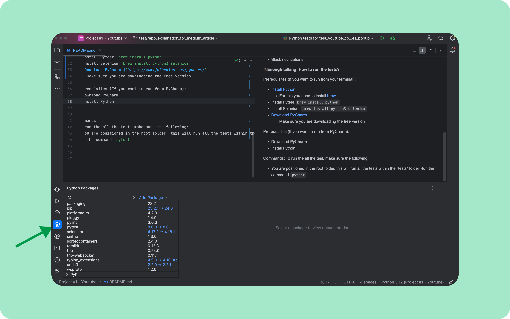

# ☕️ Automation Testing: `selenium_python_pytest` 
The intention of this repository is to create automation testing with POM with Selenium, Python and Pytest for Youtube 
app. 

## **Why Selenium, Python and Pytest?**
Even though I am pro Cypress for its quicker setup, readability, great documentation, easy access, and great community
I have found out that big companies use Selenium, Python and Pytest, I think is mainly because 
Selenium offers diversity in terms of programming language. The idea of this repo is to expand my knowledge on Selenium 
and Python; I am also have a lot of fun doing it, and I will be using this models to write medium articles. 

_Stay tuned, as the same will occur with Playwright and Appium._ 🤓

##### ⁉️ Why POM?
Page Object Model(POM) is a design pattern that allows better scalability of the test framework
it also prevents duplication of selector, as selectors are stored separately which allows easiest access to Engineers. 

##### ⁉️ What does this repo encompass?
- Automation testing with Selenium, Python, Pytest with Youtube app
- CI/CD for GitHub actions, and potentially AWS Codebuild
- Reporting
- Slack notifications

##### 🏃🏾‍Enough talking! How to run the tests?

Prerequisites (If you want to run from your terminal):
- [Install Python](https://www.python.org/downloads/macos/)
  - For this you need to install [brew](https://brew.sh/)
- Install Pytest `brew install python`
- Install Selenium `brew install python3 selenium`
- [Download PyCharm ](https://www.jetbrains.com/pycharm/)
  - Make sure you are downloading the free version

Prerequisites (If you want to run from PyCharm):
- Download PyCharm
- Install Python
  - Click on Python Packages
  - Search for the packages you need
    - selenium
    - pytest
      - _This will install the packages in your Pycharm and not your PC._

#### Commands:

To run the all the test, make sure the following:
- You are positioned in the root folder, this will run all the tests within the "tests" folder
Run the command `pytest`

